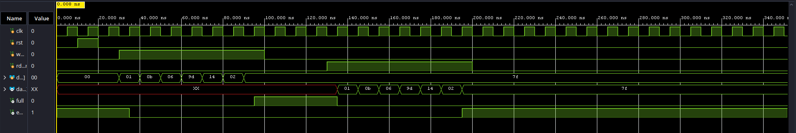
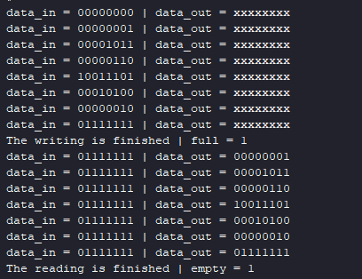

# Synchronous FIFO: Circular Buffer Architecture

## Project Overview
This project focuses on the design and verification of a **Synchronous FIFO (First-In, First-Out) buffer (8x8 bits)** using Verilog. The objective is to implement a robust circular memory architecture managed by dual pointers, ensuring safe and orderly data queuing between a producer and a consumer.

## Features

### Verilog Design
* **Circular Architecture:** Utilizes internal write (`wr_ptr`) and read (`rd_ptr`) pointers that wrap around seamlessly to manage continuous data streams.
* **Optimized Depth:** Features an 8x8 memory array with a usable capacity of 7 elements. This intentional sacrifice of one slot definitively distinguishes between `full` and `empty` states.
* **Dynamic Status Flags:** Generates accurate `full` and `empty` signals to prevent data overwriting (overflow) and invalid read operations (underflow).
* **Synchronous Control:** Write (`wr_en`) and read (`rd_en`) operations are strictly synchronized to the rising edge of the clock (`posedge clk`).

### Automated Testbench
* **Event-Driven Verification:** Employs `wait` statements (e.g., `wait(empty == 1)`) to automatically execute operations based on hardware flags, rather than relying on fixed, hardcoded time delays.
* **Synchronous Stimuli:** Inputs and control signals are applied on the falling edge of the clock (`negedge clk`) to guarantee signal stability during sampling on the rising edge.
* **Console Logging:** Uses `$monitor` and `$display` to generate a real-time execution report of data flow and flag statuses in the Tcl Console.

## Project Structure

| Folder/File | Description |
| :---------- | :---------- |
| `FIFO_design/FIFO8_8.v` | RTL implementation of the circular FIFO buffer. |
| `FIFO_tb/FIFO8_8_tb.v` | Automated testbench for functional verification. |
| `results/` | Contains Waveform screenshots and Tcl Console logs. |

## How to Run:

1. **Setup:** Add the `.v` files from the `FIFO_design` and `FIFO_tb` folders to a new project in Vivado.
2. **Simulation:** Run a Functional Simulation (`Run Simulation`).
3. **Verification:** Check the Waveforms and Tcl Console. If the data read out matches the order of the data written in, and the `full`/`empty` flags assert correctly, the test is successful.

