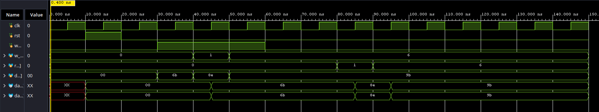
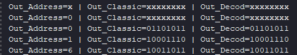

# Dual-Port RAM: Behavioral vs. Structural Design

## Project Overview
This project focuses on the implementation and comparison of two different architectures for a **Simple Dual-Port RAM (8x8 bits)** using Verilog. The objective is to analyze how synthesis tools interpret high-level behavioral descriptions versus structural logic, while establishing a robust storage core for a future FIFO (First-In, First-Out) buffer.

## Features

### Verilog Design
* **Dual-Port Architecture:** Features independent addresses for writing (`w_addr`) and reading (`rd_addr`), enabling simultaneous access to different memory locations.
* **Classic/Behavioral Mode:** Utilizes a Verilog register array (`reg [7:0] RAM [0:7]`), which is the optimal method for memory inference in FPGA synthesis.
* **Decoder/Structural Mode:** Manually implements location selection using explicit `case` logic (mimicking hardware decoders/multiplexers).
* **Asynchronous Reset:** All memory locations are initialized to `0` whenever the `rst` signal is asserted.

### Back-to-Back Testbench
* **Equivalence Checking:** Instantiates both modules simultaneously to compare their outputs in real-time under identical stimuli.
* **Synchronous Stimuli:** Inputs are applied on the falling edge of the clock (`negedge clk`) to guarantee signal stability during sampling on the rising edge.
* **Console Logging:** Uses `$display` tasks to generate a clear execution report in the Tcl Console, formatted for easy debugging.

## Project Structure

| Folder/File | Description |
| :---------- | :---------- |
| `src/Classic_RAM8_8.v` | Behavioral implementation using a register array. |
| `src/Decoder_RAM8_8.v` | Structural implementation using `case` logic. |
| `sim/General_RAM_tb.v` | Unified testbench for "Back-to-Back" comparison. |
| `results/` | Contains Waveform screenshots and Tcl Console logs. |

## How to Run:

1. **Setup:** Add the three `.v` files to a new project in Vivado.
2. **Simulation:** Run a Functional Simulation (`Run Simulation`).
4. **Verification:** Check the Tcl Console. If both modules return identical values for the same addresses, the equivalence test is successful.

## Final Notes
* **Why Dual-Port?** This structure is essential for FIFO buffers, where a producer writes data and a consumer reads it concurrently.
* **Stability:** Driving signals on the `negedge clk` in the testbench eliminates race conditions in the simulator, ensuring setup and hold time compliance.